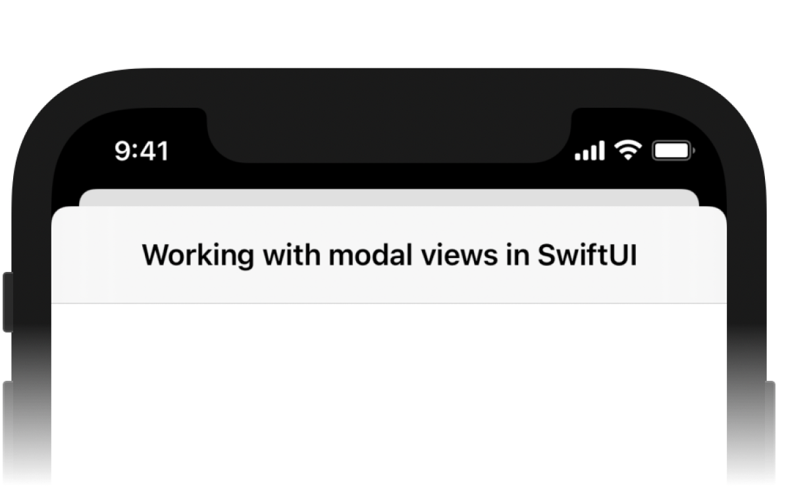

    

# Sheet Example

An example project for [Sheet happens. Working with modal views in SwiftUI](https://blog.artemnovichkov.com/editor/sheet-happens) article.

## Author

Artem Novichkov, mail@artemnovichkov.com

## License

The project is available under the MIT license. See the [LICENSE](./LICENSE) file for more info.